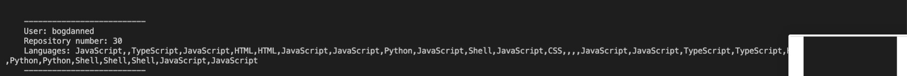
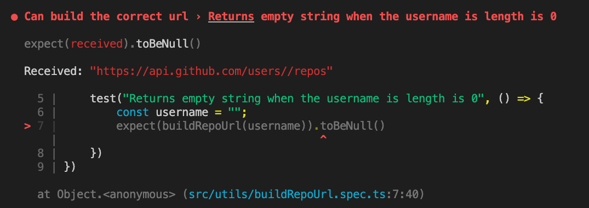
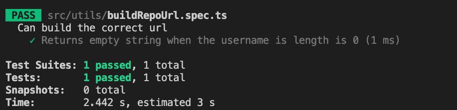
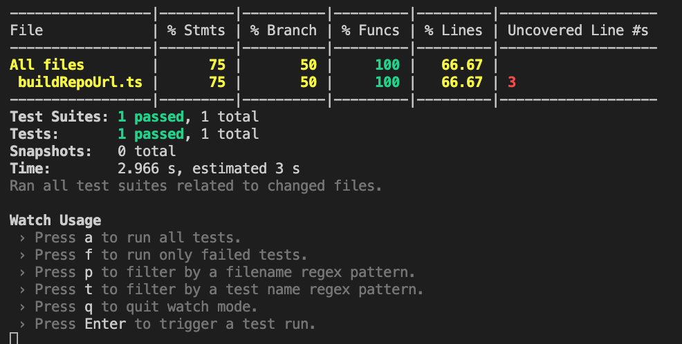
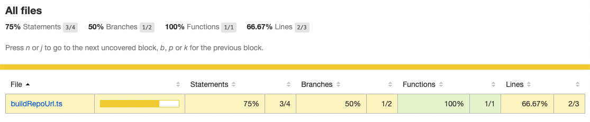

# Action Item: Testing Essentials

## About the app

This app will fetch the repository data of a Github user and print certain metrics to the console.

#### Install dependencies:
```bash
npm install
```

#### Run the app:
```bash
npm run dev
```
*You should see the following:*



### 1. Write unit tests with `jest` as the test framework

##### 1.1 Install `jest` and the type dependencies by running:
```bash
npm install --save-dev jest ts-jest @types/jest
```
##### 1.2 Setup `jest` so it can consume Typescript code by running:
```bash
npx ts-jest config:init
```
##### 1.3 Add a test script to your `package.json` that runs jest:
```javascript 
    "scripts": {
        ...,
        "test": "jest"
    },
```
##### 1.3 Add a unit test for the `buildRepoUrl` function:
###### 1.3.1 Create the `buildRepoUrl.spec.ts` file
```bash
src/utils/buildRepoUrl.spec.ts
```
###### 1.3.2 Add a simple test to it following the AAA patern:
```javascript
import buildRepoUrl from "./buildRepoUrl";

describe("Can build the correct url", () => {
    // ARRANGE
    const username = ""; // fake object / data
    test("Returns empty string when the username is length is 0", () => {
        // ACT
        const result  = buildRepoUrl(username);

        // ASSERT
        expect(result).toBeNull()
    })
})
```
##### 1.4 Run the tests and check your test result:
```bash
npm test
```
*You should see the following:*



##### 1.5 Fix the function to make the test pass:
Add the following in `buildRepoUrl.spec.ts`:
```javascript
function buildRepoUrl(username: string): string{
    if(username.length === 0) return null; // make the test pass
    return `https://api.github.com/users/${username}/repos`
}

export default buildRepoUrl;
```

##### 1.6 Run the tests and check your test result:
```bash
npm test
```
*You should see the following:*



### 1.7 Check the current code coverage:
Add the `--coverage` flag to the jest run:
```javascript 
    "scripts": {
        ...,
        "test": "jest --coverage --watch"
    },
```
And run the tests again:
```bash
npm test
```
The tests will run now continuously as you code when you change your code. This technique is close to TDD: Test Driven Development.
You should also see the current **Code Coverage**:

Check the coverage folder and open the `coverage/lcov-report/index.html` file in your browser.
##### You should see something like this:


### 1.8 Write unit tests for the following functions:
- `getAllLanguages.ts`
- `getAverageStarsPerRepos.ts`

Check the *code coverage* and try to bring it up. Write expressive messages for your test. Commit code early and often.


-----
## 2. Write integration tests and add Stubs

In this challenge we will write a test for `fetchRepositoryData`. We will use Spies and Stubs to make sure we test the function in the right way.

1. Add a test file for fetchRepositoryData:
```bash
touch src/fetchRepositoryData.spec.ts
```
2. Install `nock`, a package to stub the requests:
```bash
npm install --save-dev nock
```
3. Add the following example to a `fetchRepositoryData.spec.js` file:
```javascript 
import fetchRepositoryData from "./fetchRepositoryData";
import nock from "nock";


// Stub of the buildRepoUrl file 
jest.mock('./utils/buildRepoUrl.ts', () => {
    return {
        __esModule: true,
        default: jest.fn(() => 'http://test_url.com'),
    };
});


describe("Can fetch repositories correctly", () => {
    // ARRANGE
    test("Can fetch repositories correctly when a username is provided", async () => {
        // ARRANGE
        // Fake / Dummy Object
        const username = "test_username";

        // Mock: a repository list for testing
        const testRepositoryList = [{
            id: "34",
            stargazers_count: 30,
            language: "Java"
        }]

        // Stub for the fetch request
        nock('http://test_url.com')
            .get('/')
            .reply(200, testRepositoryList, {
                'Content-Type': 'application/json',
            });


        // ACT
        const result = await fetchRepositoryData(username)
        
        // ASSERT
        expect(result).toEqual(testRepositoryList)
    })
})
```
##### 1.4 Run the tests and check your test result:
```bash
npm test
```

##### 1.5 Complete the Code Coverage using what we learned
1. Get the code coverage as close to 100% as possible
2. Use spies, mocks, fakes and stubs to complete your tests
3. Add tests to all the missing functions


## Wrapping up

1. Make sure you push and commit your code
2. Feel free to take the exercise further and experiment yourself with the setup

### Made with :orange_heart: in Berlin by @CodeWithDragos
